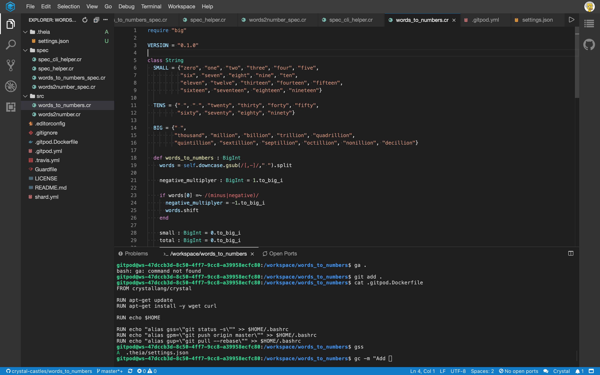

[](https://gitpod.io/#https://github.com/crystal-castles/crystal-castles.github.io)


## Crystal Castles ...
...a blog about the [Crystal Language](https://crystal-language.org)


# Crystal on GitPod

[GitPod](https://gitpod.io) is a cloud based IDE.  Please go visit their site to find out more and try it out by clicking the "ready to code" button above.

What I want to talk about today is putting your Crystal development onto GitPod.  Which takes a bit of work right now, because Crystal isn't supported out the box.

If you've used Docker before, you'll find it pretty simple and in this little guide, I'm going to keep it as simple as possible to get you up and running.

# Open your project in GitPod.io

You can get your project into GitPod very easily.  First grab the URL of your project (this also works on [GitLab](https://gitlab.com) and [BitBucket](https://bitbucket.com) BTW).  Open a new browser tab and type `https://gitpod.io/#` and paste in your URL.

Like this `https://gitpod.io/#https://github.com/myname/myrepo`

GitPod will boot up an IDE environment for you, which will allow you to edit the files in your project and give you a terminal shell to the environment too.



GitPod will offer to setup the environment for you, and ask you things like such as init/build commands and guess what language / framework you're using.

For our Crystal project, gitpod doesn't know how to setup the environment yet.  However, it's pretty simple... so let's get into the nuts and bolts.

# Configuring your project to use GitPod

We can add a `.gitpod.yml` file to our repo to configure it.  We'll also need to add a `.gitpod.Dockerfile` to use a Crystal specific Docker image instead of the ones that they provide at GitPod out the box.

### .gitpod.yml

The simplest Crystal development environment is what I'm going for here:

```
image:
  file: .gitpod.Dockerfile

tasks:
  - command: crystal spec -v
```

Let's also define the Crystal specific `.gitpod.Dockerfile` too:

### .gitpod.Dockerfile

It's _very_ simple...

```
FROM crystallang/crystal
```

Add these into the repo and commit / push the change back to GitHub.

If you just did that in GitPod itself, you shoud stop the workspace, (choose **workspace** > **stop workspace**) then delete then view Workspaces and delete the stopped workspace.  This is so you can start it up again without caching the workspace environment, and guarantee the Docker image is re-built from the new Crystal environment.

You can also update the `README.md` of your project to have a gitpod badge, which will launch the project straight into gitpod's IDE. 

```
[](https://gitpod.io/#https://github.com/username/project)
```
l
Once you're ready to code in GitPod, click that badge and away you go.

# Syntax highlighting...

GitPod's code editor does support Visual Code Extensions, and will let you select them from the extensions panel (<kbd>Shift</kbd> + <kbd>Cmd</kbd> + <kbd>x</kbd> on a Mac)

At the moment, the two Crystal Lang extensions available aren't on [Open VSX](https://open-vsx.org) the directory of VS Code Extensions GitPod uses.  But don't worry. You can download the `.vsix` file for any VS Code extension and drag it into the GitPod Extensions panel and it'll install.

I am using the [vscode-crystal-lang]() extension, here's my full `.gitpod.yml` with it installed.

```
image:
  file: .gitpod.Dockerfile

tasks:
  - command: crystal spec -v

vscode:
  extensions:
    - faustinoaq.crystal-lang@0.4.0:I0h+4m6OeYiYhRWQPFRabA==
```

To configure the plugin we need to add `.theia/settings.json` to our repo.

```
{
  "crystal-lang.compiler": "/usr/bin/crystal",
  "crystal-lang.problems": "build"
}
```

You can check in the .gitpod workspace terminal for the crystal compiler with `which crystal`, just to make sure.

See https://github.com/crystal-lang-tools/vscode-crystal-lang/wiki/Settings for more info about the extension settings.
